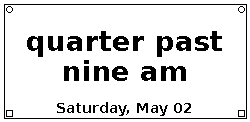

# Little Fuzzy Clock

[](https://github.com/gkoch02/littlefuzzyclock/actions/workflows/test.yml)

A fuzzy clock for a Raspberry Pi Zero driving a [Waveshare 2.13" e-ink display (V4)](https://www.waveshare.com/wiki/2.13inch_e-Paper_HAT_%28E%29).

Instead of showing an exact time, it displays natural-language phrases like "quarter past nine am" or "twenty to three pm", with the date as a footer and a small Bauhaus-inspired border.



## Hardware

- Raspberry Pi Zero (or any Pi with SPI)
- Waveshare 2.13" e-Paper HAT V4 (122×250, black/white)
- Push button between GPIO 3 (BCM, physical pin 5) and ground — used for manual refresh and shutdown. GPIO 3 doubles as the Pi's wake-from-halt pin, so the same button can also power the clock back on after a long-press shutdown.

## Behaviour

- **Day mode (sunrise – sunset, within 7 AM – 10:59 PM):** display updates every 5 minutes via partial refresh, black ink on white
- **After-hours mode (sunset – 10:59 PM):** same clock face but with the colours inverted (white ink on black). Opt-in — see [After-hours mode](#after-hours-mode) below
- **Night mode (11 PM – 6:59 AM):** shows "Goodnight" and the display sleeps
- **Short button press (0.05–2 s):** forces an immediate refresh
- **Long button press (≥ 5 s):** graceful shutdown (`shutdown -h now`)

## Rebuilding from scratch

Clone the repo anywhere on the Pi and run the deploy script. The systemd unit is templated at install time with the invoking user's home directory, so the clock works under any account — there's no need to run as `pi`:

```bash
git clone https://github.com/gkoch02/LittleFuzzyClock.git
cd LittleFuzzyClock
bash deploy.sh
```

That's it. The script installs dependencies via `apt` (Raspberry Pi OS Bookworm's PEP 668 blocks pip from touching the system Python), enables SPI, and installs and starts the `fuzzyclock.service` systemd unit.

> **Note:** If SPI wasn't already enabled, the script enables it for you, but you may need to reboot once before the display responds.

## Testing without hardware

`fuzzyClock2.py` supports a `--dry-run` mode that renders to a PNG instead of the display — useful for development on a non-Pi machine:

```bash
pip install -r requirements.txt   # only needed off-Pi; deploy.sh uses apt on-Pi
python3 fuzzyClock2.py --dry-run --output preview.png
```

## Phrasing personalities

The clock ships with six phrasings: `classic` (default), `shakespeare` (e.g. `'tis half past nine of the clock`), `klingon` (e.g. `half past Hut rep`, using actual tlhIngan Hol numerals), `belter` (e.g. `quarter to da / ten bell, ya` — Lang Belta creole from *The Expanse*), `german` (e.g. `halb zehn` for 9:30 — standard German fuzzy time, where "halb" anchors on the *next* hour), and `hal` (e.g. `MIDPOINT / NINE HUNDRED` — HAL 9000 mission-control monotone). Pick one with `--dialect`:

```bash
python3 fuzzyClock2.py --dry-run --dialect shakespeare --output preview.png
```

The daemon reads the same setting from the `FUZZYCLOCK_DIALECT` environment variable. To change it on the Pi, add a line to the systemd unit and restart:

```ini
[Service]
Environment=FUZZYCLOCK_DIALECT=shakespeare
```

Unknown values fall back to `classic` with a warning in the daemon log.

## After-hours mode

After dark, the clock flips to white-on-black so it doesn't glare at you across the room. The daemon computes local sunrise and sunset itself (no network calls) using the coordinates in `fuzzyclock_config.json`:

```json
{
  "latitude": 37.2872,
  "longitude": -121.9500
}
```

Edit those two numbers to match your location and restart the service. If the file is missing or malformed, after-hours mode stays off and the clock keeps the original day/night behaviour.

The schedule becomes: normal clock from sunrise (or wake-up at 7 AM, whichever is later) to sunset, inverted clock from sunset to bedtime at 11 PM, then "Goodnight" until 7 AM. Mode transitions are checked once per refresh tick (every 5 minutes), so the swap happens at the next tick after the sun crosses the horizon.

Sunrise/sunset are computed via NOAA's simplified solar-position equation, accurate to roughly a minute outside polar regions. At extreme latitudes where the sun never rises or never sets on a given day, the daemon stays in normal day mode.

There's also a unit test suite covering the time-phrasing logic and a render smoke test for the clock face:

```bash
python3 -m unittest discover
```

The same suite runs in CI on every push and pull request — see `.github/workflows/test.yml`.

## Files

| File | Purpose |
|------|---------|
| `fuzzyclock_daemon.py` | Production daemon — runs continuously, handles day/night mode and button presses |
| `fuzzyClock2.py` | Standalone dev script with `--dry-run` PNG output |
| `fuzzyclock_core.py` | Shared rendering logic (fuzzy time phrasing, font loading, clock layout) used by both of the above |
| `test_fuzzy_time.py` | Unit tests for `fuzzy_time()` edge cases |
| `test_render.py` | Smoke tests for `draw_border` and `render_clock` |
| `test_dry_run.py` | End-to-end test that invokes `fuzzyClock2.py --dry-run` |
| `test_sun.py` | Unit tests for the sunrise/sunset approximation used by after-hours mode |
| `.github/workflows/test.yml` | CI workflow — runs the whole suite on push/PR |
| `deploy.sh` | One-shot deploy script for fresh Pi setup |
| `fuzzyclock_config.json` | Latitude/longitude for the after-hours sunset/sunrise calculation |
| `requirements.txt` | Python deps for **dev environments** (macOS, etc.); the Pi deploy uses `apt` |
| `systemd/fuzzyclock.service` | systemd service unit (templated — `deploy.sh` substitutes the user and repo path) |
| `waveshare_epd/` | Waveshare e-Paper Python library (MIT, from [Waveshare's e-Paper repo](https://github.com/waveshare/e-Paper)) |

## License

Project code: MIT. Waveshare library files in `waveshare_epd/` are copyright Waveshare, also MIT licensed.
