# Font variants

All previews show the same moment — `9:15 am` in the `classic` dialect — so the typefaces are directly comparable. The display is 250 × 122 px (Waveshare 2.13" e-ink, landscape).

Set the active font in `fuzzyclock_config.yaml`:

```yaml
font: libertinus
```

Or try one in a dry-run render:

```bash
python3 fuzzyClock2.py --dry-run --font libertinus --output preview.png
```

Unknown values fall back to `dejavu` with a warning in the daemon log.

## Random mode

```yaml
font: random
```

Picks a fresh vendored variant each time the time phrase rolls over to the next 5-minute bucket — every phrase change comes with a new typeface. Only fonts whose file is actually present in `fonts/` are eligible, so a clean Pi without any commercial faces dropped in still works (it just rolls from the OFL set). A short button-press refresh keeps the current font; the variant only changes when the phrase itself does.

---

## Sourcing

Each preview's `<sup>` line indicates how the font reaches the daemon:

- **`apt: ...`** — installed automatically by `deploy.sh` on the Pi; no extra steps.
- **`OFL · ...`** / **`Apache 2.0 · ...`** — vendored in this repo's `fonts/` directory; works on any machine.
- **`Commercial · drop ... into fonts/`** — no apt package and not redistributable here. Provide the file yourself; the daemon falls back to a macOS system font for dev renders when no file is present.

Variants are grouped by theme/vibe and sorted alphabetically within each group.

---

## Clean & everyday

Neutral, readable workhorses — for when you want the time to feel ordinary.

<table>
<tr>
<td align="center">
<br><br>
<strong><code>cantarell</code></strong><br>
<sup>apt: fonts-cantarell</sup><br>
GNOME's humanist sans — tall x-height, friendly curves.
</td>
<td align="center">
<br><br>
<strong><code>dejavu</code></strong> <em>(default)</em><br>
<sup>apt: fonts-dejavu-core</sup><br>
Clean humanist sans — high x-height, broad Unicode coverage.
</td>
</tr>
<tr>
<td align="center">
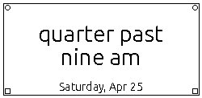<br><br>
<strong><code>ubuntu</code></strong><br>
<sup>apt: fonts-ubuntu</sup><br>
Distinctive warm sans with subtle calligraphic terminals.
</td>
<td></td>
</tr>
</table>

---

## Classic & literary serifs

Reading-focused serifs with traditional proportions — book pages and printed essays in miniature. The commercial drop-ins live here too: most were designed for long-form reading.

<table>
<tr>
<td align="center">
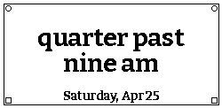<br><br>
<strong><code>bitter</code></strong><br>
<sup>OFL · variable</sup><br>
High-contrast slab serif — confident vertical stress on e-ink.
</td>
<td align="center">
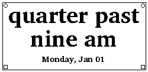<br><br>
<strong><code>charis-sil</code></strong><br>
<sup>SIL OFL · static · apt: fonts-sil-charis</sup><br>
Warm humanist serif — generous x-height, broad glyph coverage.
</td>
</tr>
<tr>
<td align="center">
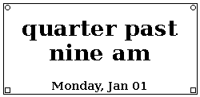<br><br>
<strong><code>dejavu-serif</code></strong><br>
<sup>apt: fonts-dejavu</sup><br>
Elegant transitional serif companion to DejaVu Sans.
</td>
<td align="center">
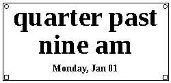<br><br>
<strong><code>liberation-serif</code></strong><br>
<sup>apt: fonts-liberation2</sup><br>
Times-metric serif — newspaper feel, very readable at small sizes.
</td>
</tr>
<tr>
<td align="center">
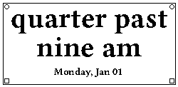<br><br>
<strong><code>libertinus</code></strong><br>
<sup>OFL · static OTF</sup><br>
Open successor to Linux Libertine — classical book serif.
</td>
<td align="center">
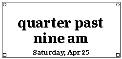<br><br>
<strong><code>literata</code></strong><br>
<sup>OFL · variable</sup><br>
Optically sized book serif — refined and even-toned.
</td>
</tr>
<tr>
<td align="center">
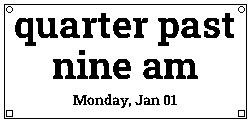<br><br>
<strong><code>roboto-slab</code></strong><br>
<sup>apt: fonts-roboto-slab</sup><br>
Chunky slab serif — renders especially crisply on e-ink.
</td>
<td></td>
</tr>
</table>

**Commercial drop-ins** — drop the listed file into `fonts/` to unlock:

| Variant | File | Publisher | Character |
|---------|------|-----------|-----------|
| `arno` | `ArnoPro-Bold.otf` | Adobe | Old-style text serif in the tradition of the early Venetian printers; compact and elegant. |
| `bookerly` | `Bookerly-Bold.ttf` | Amazon (Kindle) | Warm humanist serif designed for long reading sessions; optimised for screen rendering. |
| `chaparral` | `ChaparralPro-Bold.otf` | Adobe | Humanist slab serif blending serif warmth with slab structure; very even on e-ink. |
| `livory` | `Livory-Bold.otf` | iA (Information Architects) | Transitional serif with calligraphic warmth; designed for iA Writer. |
| `malabar` | `Malabar-Bold.otf` | Linotype | Sturdy hybrid serif with slab tendencies; originally designed for newspaper body text. |
| `minion` | `MinionPro-Bold.otf` | Adobe | Classic old-style serif inspired by Renaissance-era type; timeless and space-efficient. |

---

## Slab serif

Sturdy bracketed slabs — from crisp geometric (Arvo, Josefin Slab) to warm humanist (Zilla Slab) to chunky literary (Rokkitt) to softened slab terminals (Crete Round).

<table>
<tr>
<td align="center">
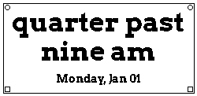<br><br>
<strong><code>arvo</code></strong><br>
<sup>OFL · static</sup><br>
Clean geometric slab — high contrast, confident strokes.
</td>
<td align="center">
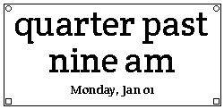<br><br>
<strong><code>crete-round</code></strong><br>
<sup>OFL · static</sup><br>
Rounded slab terminals — soft-but-solid, distinctive feel.
</td>
</tr>
<tr>
<td align="center">
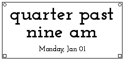<br><br>
<strong><code>josefin-slab</code></strong><br>
<sup>OFL · variable</sup><br>
Geometric slab — strong thin/thick contrast; elegant at display sizes.
</td>
<td align="center">
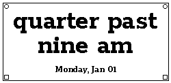<br><br>
<strong><code>rokkitt</code></strong><br>
<sup>OFL · variable</sup><br>
Chunky literary slab — confident and even-toned on e-ink.
</td>
</tr>
<tr>
<td align="center">
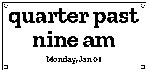<br><br>
<strong><code>zilla-slab</code></strong><br>
<sup>OFL · static</sup><br>
Mozilla humanist slab — warm and screen-optimised.
</td>
<td></td>
</tr>
</table>

---

## Soft & rounded

Friendly geometric curves — informal warmth, approachable at any size.

<table>
<tr>
<td align="center">
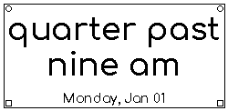<br><br>
<strong><code>comfortaa</code></strong><br>
<sup>OFL · variable · apt: fonts-comfortaa</sup><br>
Rounded geometric sans — warm and friendly.
</td>
<td align="center">
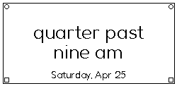<br><br>
<strong><code>fredoka</code></strong><br>
<sup>OFL · variable · apt: fonts-fredoka</sup><br>
Rounded display — soft, friendly geometric shapes.
</td>
</tr>
<tr>
<td align="center">
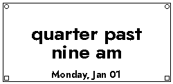<br><br>
<strong><code>jost</code></strong><br>
<sup>OFL · variable</sup><br>
Geometric sans inspired by Futura — clean and modern.
</td>
<td align="center">
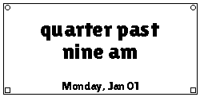<br><br>
<strong><code>lilita-one</code></strong><br>
<sup>OFL · static</sup><br>
Chunky Latin display — bold and cartoonish in the best way.
</td>
</tr>
<tr>
<td align="center">
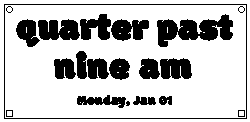<br><br>
<strong><code>modak</code></strong><br>
<sup>OFL · static</sup><br>
Extreme inflated bubble — letters look pressurized, Devanagari-inspired.
</td>
<td align="center">
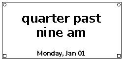<br><br>
<strong><code>nunito</code></strong><br>
<sup>OFL · variable</sup><br>
Rounded sans — generous x-height, approachable at any size.
</td>
</tr>
</table>

---

## Geometric & condensed

Clean geometric proportions and condensed widths — from balanced all-round workhorse to Art Deco elegance to space-saving condensed type. Condensed faces like Oswald fit longer fuzzy-time phrases on one line at a larger point size.

<table>
<tr>
<td align="center">
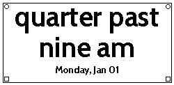<br><br>
<strong><code>cabin</code></strong><br>
<sup>OFL · variable</sup><br>
Humanist geometric sans — slightly warmer than Poppins.
</td>
<td align="center">
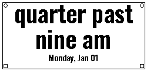<br><br>
<strong><code>oswald</code></strong><br>
<sup>OFL · variable</sup><br>
Condensed sans — fits long dialect phrases at a larger size.
</td>
</tr>
<tr>
<td align="center">
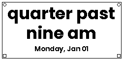<br><br>
<strong><code>poppins</code></strong><br>
<sup>OFL · static</sup><br>
Balanced geometric sans — uniform stroke, contemporary feel.
</td>
<td align="center">
<br><br>
<strong><code>raleway</code></strong><br>
<sup>OFL · variable</sup><br>
Art Deco geometric — distinctive double-storey 'W'.
</td>
</tr>
<tr>
<td align="center">
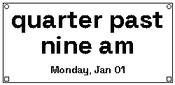<br><br>
<strong><code>space-grotesk</code></strong><br>
<sup>OFL · static</sup><br>
Quirky geometric sans — slightly irregular strokes give it personality.
</td>
<td align="center">
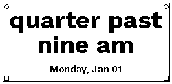<br><br>
<strong><code>work-sans</code></strong><br>
<sup>OFL · variable</sup><br>
Utilitarian geometric sans — clean and legible at any size.
</td>
</tr>
</table>

---

## Bold display & poster

Big shouty character — signage, comic, slab, condensed. The clock as a poster.

<table>
<tr>
<td align="center">
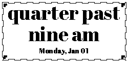<br><br>
<strong><code>abril-fatface</code></strong><br>
<sup>OFL · static</sup><br>
Fashion-magazine ultra-bold display serif — high contrast.
</td>
<td align="center">
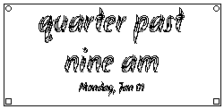<br><br>
<strong><code>akronim</code></strong><br>
<sup>OFL · static</sup><br>
Frantic outlined italic — loose hand-drawn caps, kinetic and untidy.
</td>
</tr>
<tr>
<td align="center">
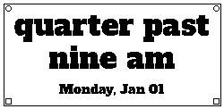<br><br>
<strong><code>alfa-slab-one</code></strong><br>
<sup>OFL · static</sup><br>
Chunky bold slab — confident, immovable.
</td>
<td align="center">
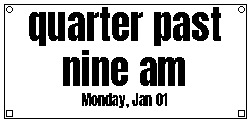<br><br>
<strong><code>anton</code></strong><br>
<sup>OFL · static</sup><br>
Tall condensed poster sans — fits long phrases easily.
</td>
</tr>
<tr>
<td align="center">
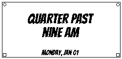<br><br>
<strong><code>bangers</code></strong><br>
<sup>OFL · static</sup><br>
Comic-book display — bold, condensed, pop-art energy.
</td>
<td align="center">
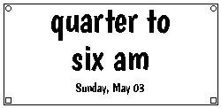<br><br>
<strong><code>boogaloo</code></strong><br>
<sup>OFL · static</sup><br>
Retro casual comic/poster — lighter and breezier than Bangers.
</td>
</tr>
<tr>
<td align="center">
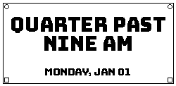<br><br>
<strong><code>bungee</code></strong><br>
<sup>OFL · static</sup><br>
David Jonathan Ross signage face — architectural and bold.
</td>
<td align="center">
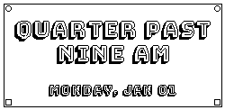<br><br>
<strong><code>bungee-shade</code></strong><br>
<sup>OFL · static</sup><br>
3D perspective shadow block below each letter — architectural and striking.
</td>
</tr>
<tr>
<td align="center">
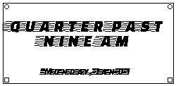<br><br>
<strong><code>faster-one</code></strong><br>
<sup>OFL · static</sup><br>
Extreme italic condensed — maximum rightward lean, racing energy.
</td>
<td align="center">
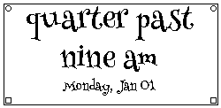<br><br>
<strong><code>henny-penny</code></strong><br>
<sup>OFL · static</sup><br>
Wobbly storybook display — organic stroke widths, pleasantly falling apart.
</td>
</tr>
<tr>
<td align="center">
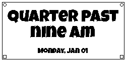<br><br>
<strong><code>luckiest-guy</code></strong><br>
<sup>OFL · static</sup><br>
Cereal-box cartoon — irregular baseline, high-energy retro fun.
</td>
<td align="center">
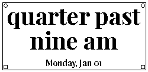<br><br>
<strong><code>playfair</code></strong><br>
<sup>OFL · variable</sup><br>
High-contrast display serif — dramatic stroke variation.
</td>
</tr>
<tr>
<td align="center">
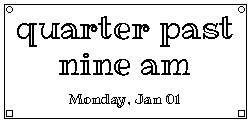<br><br>
<strong><code>ribeye-marrow</code></strong><br>
<sup>OFL · static</sup><br>
Hollow inline display serif — only the outline remains, marrow scooped out.
</td>
<td align="center">
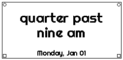<br><br>
<strong><code>righteous</code></strong><br>
<sup>OFL · static</sup><br>
Art Deco geometric sans — retro-modern personality.
</td>
</tr>
<tr>
<td align="center">
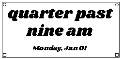<br><br>
<strong><code>shrikhand</code></strong><br>
<sup>OFL · static</sup><br>
Gujarati calligraphy-inspired bold — ink traps and terminals unlike any Latin font.
</td>
<td align="center">
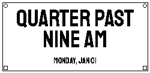<br><br>
<strong><code>staatliches</code></strong><br>
<sup>OFL · static</sup><br>
Bauhaus all-caps — extreme width contrast.
</td>
</tr>
<tr>
<td align="center">
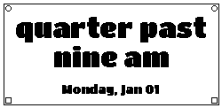<br><br>
<strong><code>titan-one</code></strong><br>
<sup>OFL · static</sup><br>
Super-chunky rounded bold — compact punch, maximum presence.
</td>
<td></td>
</tr>
</table>

**Commercial drop-ins** — drop the listed file into `fonts/` to unlock:

| Variant | File | Publisher | Character |
|---------|------|-----------|-----------|
| `pigeonette` | `Pigeonette-Bold.otf`, `Pigeonette-Regular.otf`, or `Pigeonette.otf` | Tortilla Studio ([Future Fonts](https://www.futurefonts.xyz/tortillastudio/pigeonette)) | Idiosyncratic display serif with expressive stroke contrast. |

### More bold display

<table>
<tr>
<td align="center">
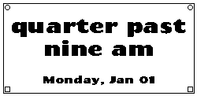<br><br>
<strong><code>chango</code></strong><br>
<sup>OFL · static</sup><br>
Single-weight ultra-heavy Latin display — fills every pixel with imposing mass.
</td>
<td align="center">
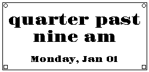<br><br>
<strong><code>gravitas-one</code></strong><br>
<sup>OFL · static</sup><br>
Maximum-weight display serif — brutal ink coverage, deep ink traps.
</td>
</tr>
</table>

---

## Vintage, deco & futuristic

1920s marquee through retro-futuristic chrome — Wild West poster type, Art Deco, Art Nouveau, Space Age, sci-fi.

<table>
<tr>
<td align="center">
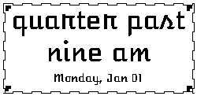<br><br>
<strong><code>atomic-age</code></strong><br>
<sup>OFL · static</sup><br>
Outlined Space Age display — '50s science-fiction inline.
</td>
<td align="center">
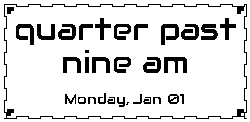<br><br>
<strong><code>audiowide</code></strong><br>
<sup>OFL · static</sup><br>
Retro-futuristic chrome — hi-fi receiver vibe.
</td>
</tr>
<tr>
<td align="center">
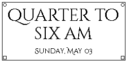<br><br>
<strong><code>cinzel-decorative</code></strong><br>
<sup>OFL · static</sup><br>
Ornate Roman capitals with Art Deco serifs — regal, all-caps only.
</td>
<td align="center">
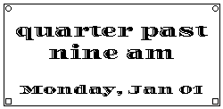<br><br>
<strong><code>diplomata</code></strong><br>
<sup>OFL · static</sup><br>
Heavily ornamented Art Deco caps — diploma-grade engraving.
</td>
</tr>
<tr>
<td align="center">
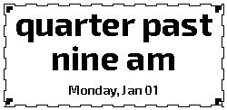<br><br>
<strong><code>exo-2</code></strong><br>
<sup>OFL · variable</sup><br>
Techno-geometric variable — bridges vintage and sci-fi.
</td>
<td align="center">
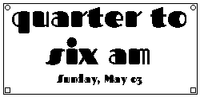<br><br>
<strong><code>fascinate</code></strong><br>
<sup>OFL · static</sup><br>
Art Deco inline — white channel through each stroke, striking on e-ink.
</td>
</tr>
<tr>
<td align="center">
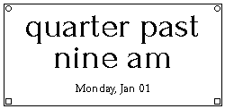<br><br>
<strong><code>forum</code></strong><br>
<sup>OFL · static</sup><br>
Elegant Art Nouveau Roman — calligraphic influence, lighter than Cinzel.
</td>
<td align="center">
<br><br>
<strong><code>iceland</code></strong><br>
<sup>OFL · static</sup><br>
Geometric blocky display — Nordic rune-like construction.
</td>
</tr>
<tr>
<td align="center">
<br><br>
<strong><code>limelight</code></strong><br>
<sup>OFL · static</sup><br>
1920s theatre marquee — vintage display serif.
</td>
<td align="center">
<br><br>
<strong><code>megrim</code></strong><br>
<sup>OFL · static</sup><br>
Constructed thin-stroke Art Nouveau — built from straight lines and circles.
</td>
</tr>
<tr>
<td align="center">
<br><br>
<strong><code>monoton</code></strong><br>
<sup>OFL · static</sup><br>
Multi-line striped art-deco caps — striking silhouette.
</td>
<td align="center">
<br><br>
<strong><code>orbitron</code></strong><br>
<sup>OFL · variable</sup><br>
Geometric sci-fi display — clean techno feel.
</td>
</tr>
<tr>
<td align="center">
<br><br>
<strong><code>poiret-one</code></strong><br>
<sup>OFL · static</sup><br>
Art Deco hairline geometric — distinctive thin strokes.
</td>
<td align="center">
<br><br>
<strong><code>rye</code></strong><br>
<sup>OFL · static</sup><br>
Wild West poster — ornate inline decorations inside every bracketed serif.
</td>
</tr>
<tr>
<td align="center">
<br><br>
<strong><code>sancreek</code></strong><br>
<sup>OFL · static</sup><br>
Wild West cracked engraved poster serif — wanted-poster energy.
</td>
<td align="center">
<br><br>
<strong><code>smokum</code></strong><br>
<sup>Apache 2.0 · static</sup><br>
Western circus marquee — outlined slab with curling smoke wisps.
</td>
</tr>
<tr>
<td align="center">
<br><br>
<strong><code>syncopate</code></strong><br>
<sup>Apache 2.0 · static</sup><br>
All-caps techno geometric — architectural, no lowercase glyphs.
</td>
<td align="center">
<br><br>
<strong><code>wallpoet</code></strong><br>
<sup>OFL · static</sup><br>
Chiselled stone techno — block letters with horizontal grooves cut through every stroke.
</td>
</tr>
<tr>
<td align="center">
<br><br>
<strong><code>baumans</code></strong><br>
<sup>OFL · static</sup><br>
Techno-mechanical constructed from circles and straight rules — hi-fi instrument dials.
</td>
<td align="center">
<br><br>
<strong><code>mystery-quest</code></strong><br>
<sup>OFL · static</sup><br>
Alien sci-fi display — letterforms with UFO-landing-zone cut-outs and strange angular gaps.
</td>
</tr>
<tr>
<td align="center">
<br><br>
<strong><code>oi</code></strong><br>
<sup>OFL · static</sup><br>
Victorian ornamental display — elaborate swash caps with inline filigree decoration.
</td>
<td align="center">
<br><br>
<strong><code>emblema-one</code></strong><br>
<sup>OFL · static</sup><br>
Outlined decorative display — inline channels carved through bold exotic caps.
</td>
</tr>
<tr>
<td align="center">
<br><br>
<strong><code>flamenco</code></strong><br>
<sup>OFL · static</sup><br>
Art Nouveau calligraphic display — organic curved spurs growing from every terminal.
</td>
<td align="center">
<br><br>
<strong><code>tourney</code></strong><br>
<sup>OFL · variable</sup><br>
Racing championship variable — extreme condensed wdth axis, chequered-flag energy.
</td>
</tr>
</table>

---

## Retro & computing

Terminal, pixel, 8-bit nostalgia — plus the variable oddities that warp through machined and folded territory.

<table>
<tr>
<td align="center">
<br><br>
<strong><code>courier-prime</code></strong><br>
<sup>OFL · static</sup><br>
Refined typewriter serif — more character than Courier New.
</td>
<td align="center">
<br><br>
<strong><code>fira-mono</code></strong><br>
<sup>OFL · static</sup><br>
Clean coding mono — readable and refined at small sizes.
</td>
</tr>
<tr>
<td align="center">
<br><br>
<strong><code>foldit</code></strong><br>
<sup>OFL · variable</sup><br>
Origami creased letterforms — every stroke looks like folded paper.
</td>
<td align="center">
<br><br>
<strong><code>jetbrains-mono</code></strong><br>
<sup>apt: fonts-jetbrains-mono</sup><br>
Modern monospaced — typewriter personality on e-ink.
</td>
</tr>
<tr>
<td align="center">
<br><br>
<strong><code>press-start-2p</code></strong><br>
<sup>OFL · static</sup><br>
8-bit arcade pixel font — quarter-eating energy.
</td>
<td align="center">
<br><br>
<strong><code>share-tech-mono</code></strong><br>
<sup>OFL · static</sup><br>
Techno grid mono — sci-fi terminal aesthetic.
</td>
</tr>
<tr>
<td align="center">
<br><br>
<strong><code>silkscreen</code></strong><br>
<sup>OFL · static</sup><br>
Bitmap-style display — late-90s desktop UI nostalgia.
</td>
<td align="center">
<br><br>
<strong><code>sixtyfour</code></strong><br>
<sup>OFL · variable</sup><br>
C64 CRT scanlines — retro-computing pixel grid with deliberate bleed.
</td>
</tr>
<tr>
<td align="center">
<br><br>
<strong><code>vt323</code></strong><br>
<sup>OFL · static</sup><br>
CRT terminal — chunky monospace, late-70s computing.
</td>
<td align="center">
<br><br>
<strong><code>workbench</code></strong><br>
<sup>OFL · variable</sup><br>
Machined dot-matrix industrial — bled and scanned axes give workshop-printer feel.
</td>
</tr>
</table>

---

## Blackletter & fantasy

Medieval, gothic, storybook — manuscripts, spellbooks, and angular runic geometry.

<table>
<tr>
<td align="center">
<br><br>
<strong><code>almendra-display</code></strong><br>
<sup>OFL · static</sup><br>
Pen-drawn Gothic calligraphic — elaborate ink swells, medieval fantasy.
</td>
<td align="center">
<br><br>
<strong><code>astloch</code></strong><br>
<sup>OFL · static</sup><br>
Bold runic medieval — angular geometric blackletter built from sharp wedges.
</td>
</tr>
<tr>
<td align="center">
<br><br>
<strong><code>medieval-sharp</code></strong><br>
<sup>OFL · static</sup><br>
Storybook fantasy — readable medieval display.
</td>
<td align="center">
<br><br>
<strong><code>nabla</code></strong><br>
<sup>OFL · variable · COLR/CPAL</sup><br>
3D faceted extrusion designed as a colour font; renders on e-ink as nested outlined geometry — gothic, structural, unlike anything else here.
</td>
</tr>
<tr>
<td align="center">
<br><br>
<strong><code>pirata-one</code></strong><br>
<sup>OFL · static</sup><br>
Decorative pirate / treasure-map blackletter.
</td>
<td align="center">
<br><br>
<strong><code>unifraktur-maguntia</code></strong><br>
<sup>OFL · static</sup><br>
Full gothic blackletter — medieval manuscript feel.
</td>
</tr>
</table>

---

## Flowing script & calligraphy

Flowing connected cursives and formal calligraphic scripts — elegant, personal, occasion-ready. Bold weights where available; thin-stroked faces like Tangerine and Parisienne may look delicate at small auto-sizes.

<table>
<tr>
<td align="center">
<br><br>
<strong><code>clicker-script</code></strong><br>
<sup>OFL · static</sup><br>
Thick connecting brush script — bold and legible on e-ink.
</td>
<td align="center">
<br><br>
<strong><code>dancing-script</code></strong><br>
<sup>OFL · variable</sup><br>
Flowing connected cursive — the most popular script on Google Fonts.
</td>
</tr>
<tr>
<td align="center">
<br><br>
<strong><code>parisienne</code></strong><br>
<sup>OFL · static</sup><br>
French ornamental script — decorative loops and flourishes.
</td>
<td align="center">
<br><br>
<strong><code>splash</code></strong><br>
<sup>OFL · static</sup><br>
Liquid brush splash — connected calligraphic ink, very wet.
</td>
</tr>
<tr>
<td align="center">
<br><br>
<strong><code>tangerine</code></strong><br>
<sup>OFL · static</sup><br>
Elegant copperplate calligraphy — refined and formal.
</td>
<td align="center">
<br><br>
<strong><code>yellowtail</code></strong><br>
<sup>Apache 2.0 · static</sup><br>
Condensed calligraphic brush — stylish and compact.
</td>
</tr>
</table>

---

## Handwriting & casual script

Cursive, brush, typewriter, marker — informal, hand-made character.

<table>
<tr>
<td align="center">
<br><br>
<strong><code>lobster</code></strong><br>
<sup>OFL · static</sup><br>
Bold script — heavier and more decorative than Pacifico.
</td>
<td align="center">
<br><br>
<strong><code>pacifico</code></strong><br>
<sup>OFL · static</sup><br>
Casual brush-script — maximally playful.
</td>
</tr>
<tr>
<td align="center">
<br><br>
<strong><code>permanent-marker</code></strong><br>
<sup>Apache 2.0 · static</sup><br>
Felt-tip handwriting — looks like whiteboard scribble.
</td>
<td align="center">
<br><br>
<strong><code>special-elite</code></strong><br>
<sup>Apache 2.0 · static</sup><br>
Distressed typewriter — uneven inking, ribbon strikes.
</td>
</tr>
<tr>
<td align="center">
<br><br>
<strong><code>unkempt</code></strong><br>
<sup>Apache 2.0 · static</sup><br>
Scrawly asymmetric handwriting — deliberately wild loops, uneven baseline, zero composure.
</td>
<td></td>
</tr>
</table>

---

## Notebook & hand-drawn

Ballpoint, marker, classroom print — neat hand-made character that still reads cleanly at clock size.

<table>
<tr>
<td align="center">
<br><br>
<strong><code>amatic-sc</code></strong><br>
<sup>OFL · static</sup><br>
Tall thin all-caps handwritten — fits long phrases.
</td>
<td align="center">
<br><br>
<strong><code>architects-daughter</code></strong><br>
<sup>OFL · static</sup><br>
Neat block-letter print — drafting-style hand.
</td>
</tr>
<tr>
<td align="center">
<br><br>
<strong><code>caveat</code></strong><br>
<sup>OFL · variable</sup><br>
Connected ballpoint cursive — quick personal notes.
</td>
<td align="center">
<br><br>
<strong><code>gloria-hallelujah</code></strong><br>
<sup>Apache 2.0 · static</sup><br>
Loose kid-like print — wobbly baseline, joyful.
</td>
</tr>
<tr>
<td align="center">
<br><br>
<strong><code>homemade-apple</code></strong><br>
<sup>Apache 2.0 · static</sup><br>
Quick handwritten cursive — looped and personal.
</td>
<td align="center">
<br><br>
<strong><code>indie-flower</code></strong><br>
<sup>Apache 2.0 · static</sup><br>
Bouncy uneven print — friendly and informal.
</td>
</tr>
<tr>
<td align="center">
<br><br>
<strong><code>kalam</code></strong><br>
<sup>OFL · static</sup><br>
Rounded everyday handwriting — Indian Type Foundry.
</td>
<td align="center">
<br><br>
<strong><code>patrick-hand</code></strong><br>
<sup>OFL · static</sup><br>
Open clean handwriting — very legible at small sizes.
</td>
</tr>
<tr>
<td align="center">
<br><br>
<strong><code>reenie-beanie</code></strong><br>
<sup>OFL · static</sup><br>
Slanted notebook scribble — back-of-the-book doodle.
</td>
<td align="center">
<br><br>
<strong><code>shadows-into-light</code></strong><br>
<sup>OFL · static</sup><br>
Light marker on paper — airy, softly slanted.
</td>
</tr>
</table>

---

## Textured & experimental

Letterforms filled with pattern, texture, distortion, or melted into puddles — appearance over legibility. The Rubik Filtered family ships a wide collection of weirdness modes from the same chassis; the rest are one-off oddities.

<table>
<tr>
<td align="center">
<br><br>
<strong><code>codystar</code></strong><br>
<sup>OFL · static</sup><br>
Star-pattern stencil — letterforms assembled from clusters of dots.
</td>
<td align="center">
<br><br>
<strong><code>freckle-face</code></strong><br>
<sup>OFL · static</sup><br>
Speckled / freckled letterforms — each character has a pressed-in texture.
</td>
</tr>
<tr>
<td align="center">
<br><br>
<strong><code>plaster</code></strong><br>
<sup>OFL · static</sup><br>
Heavy stencil plaster — slab industrial relief, feels poured.
</td>
<td align="center">
<br><br>
<strong><code>rampart-one</code></strong><br>
<sup>OFL · static</sup><br>
Letters built from masonry — towers, ramparts, and brick walls.
</td>
</tr>
<tr>
<td align="center">
<br><br>
<strong><code>rubik-beastly</code></strong><br>
<sup>OFL · static</sup><br>
Chunky furry-creature shapes — letters that look like tiny beasts.
</td>
<td align="center">
<br><br>
<strong><code>rubik-dirt</code></strong><br>
<sup>OFL · static</sup><br>
Dirt and debris embedded in the strokes — deliberately rough fill.
</td>
</tr>
<tr>
<td align="center">
<br><br>
<strong><code>rubik-distressed</code></strong><br>
<sup>OFL · static</sup><br>
Heavily eroded grunge — letters that look worn down by sandpaper.
</td>
<td align="center">
<br><br>
<strong><code>rubik-glitch</code></strong><br>
<sup>OFL · static</sup><br>
Letters torn apart by digital glitch — slipped slices and corrupted shapes.
</td>
</tr>
<tr>
<td align="center">
<br><br>
<strong><code>rubik-iso</code></strong><br>
<sup>OFL · static</sup><br>
Isometric 3D outlined — architectural perspective on every glyph.
</td>
<td align="center">
<br><br>
<strong><code>rubik-maze</code></strong><br>
<sup>OFL · static</sup><br>
Every stroke filled with a continuous maze pattern — genuinely strange.
</td>
</tr>
<tr>
<td align="center">
<br><br>
<strong><code>rubik-microbe</code></strong><br>
<sup>OFL · static</sup><br>
Cellular microbe texture across every stroke — petri-dish typography.
</td>
<td align="center">
<br><br>
<strong><code>rubik-puddles</code></strong><br>
<sup>OFL · static</sup><br>
Letterforms melted into puddles — gravity won.
</td>
</tr>
<tr>
<td align="center">
<br><br>
<strong><code>rubik-spray-paint</code></strong><br>
<sup>OFL · static</sup><br>
Spray-painted stencil with overspray dots — graffiti-tag energy.
</td>
<td align="center">
<br><br>
<strong><code>rubik-wet-paint</code></strong><br>
<sup>OFL · static</sup><br>
Paint dripping down each stroke — fresh-coat-of-paint vandalism.
</td>
</tr>
<tr>
<td align="center">
<br><br>
<strong><code>kablammo</code></strong><br>
<sup>OFL · variable · MORF axis</sup><br>
Inflated balloon variable font — the MORF axis bloats letterforms into pressurised rubber bubbles.
</td>
<td></td>
</tr>
</table>

---

## Horror & macabre

Drippy, bitten, blood-spattered, skeletal letterforms — the Halloween / horror corner of the gallery.

<table>
<tr>
<td align="center">
<br><br>
<strong><code>butcherman</code></strong><br>
<sup>OFL · static</sup><br>
Splatter horror display — uneven, ragged, slightly threatening.
</td>
<td align="center">
<br><br>
<strong><code>creepster</code></strong><br>
<sup>OFL · static</sup><br>
Halloween / horror display — seasonal novelty.
</td>
</tr>
<tr>
<td align="center">
<br><br>
<strong><code>eater</code></strong><br>
<sup>OFL · static</sup><br>
Bites taken out of the letterforms — gnawed-on type.
</td>
<td align="center">
<br><br>
<strong><code>jolly-lodger</code></strong><br>
<sup>OFL · static</sup><br>
Skeletal carnival display — hollow-bone strokes, slightly creepy fairground.
</td>
</tr>
<tr>
<td align="center">
<br><br>
<strong><code>lacquer</code></strong><br>
<sup>OFL · static</sup><br>
Thick lacquered marker — wet-glossy painted strokes.
</td>
<td align="center">
<br><br>
<strong><code>nosifer</code></strong><br>
<sup>OFL · static</sup><br>
Blood dripping from every stroke — proper Halloween horror.
</td>
</tr>
</table>
